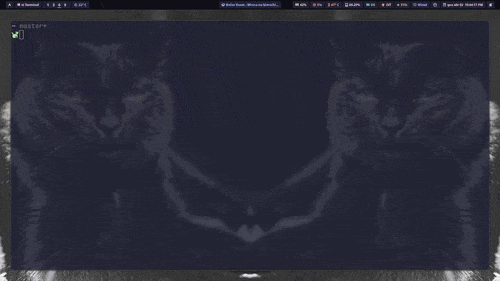

# 🥶📝 Cold-Note: A Fast Note-Creating CLI Tool

Cold-Note is a lightweight and customizable command-line tool designed to streamline note creation and organization for Obsidian users. With built-in templating, metadata handling, and Neovim integration, it helps you create structured notes efficiently.

### ✨ Features

🚀 Quick Note Creation – Stylish Interface powered by [charmbracelet-huh](https://github.com/charmbracelet/huh).

📁 Smart Directory Management – Automatically selects organized vault directories.

📜 Dynamic Templates – Supports multiple markdown templates with variables.

📝 Metadata Automation – Generates YAML frontmatter with tags, aliases, and timestamps.

💻 Seamless Editor Integration – Opens notes in Neovim Zen Mode for focused writing.

⚡ Environment-Based Configuration – Uses OBSIDIAN_VAULT and OBSIDIAN_TEMPLATES for flexibility.

### 🛠 Requirements

- Go 1.21+
- Neovim
- Obsidian
- Properly set environment variables (OBSIDIAN_VAULT, OBSIDIAN_TEMPLATES)



# Install and run

To use this program your need to first clone [this repository](https://github.com/peruzzoarthur/go-note).

```bash

git clone https://github.com/peruzzoarthur/go-note.git

```

Then change into the cloned project, run build and move the binary file to your binaries path.

```bash
cd go-note
go build -o note cmd/note/main.go
sudo mv note /usr/local/bin/
```

In order to find the Obsidian vault and be able to import the templates for the .md files, declare the environment variables in your shell config file.

```bash
echo 'export OBSIDIAN_VAULT="/home/user/vault/path"' >> ~/.zshrc # adjust filename for your shell config file
echo 'export OBSIDIAN_TEMPLATES="/home/user/templates/path"' >> ~/.zshrc
```

All Done! Cold-note is now installed and configured. It can be run using:

```bash

note

```

> [!WARNING]
> The module default configuration strictly focuses on directories starting with numbers (a common Obsidian organization pattern).
> In other words: 'the directories where you create your notes must start with a number'. e.g. '00-inbox', '1-projects'
